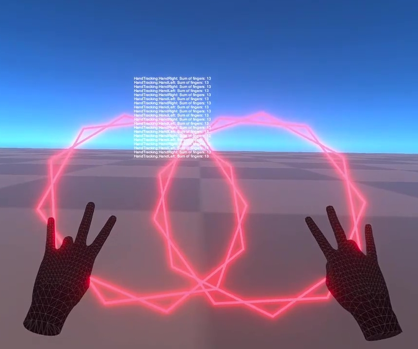

# TrackingHands
Hand Tracking for the Meta Quest 2.

In this project, we're creating a spell casting system in Unity for Virtual Reality applications, specifically designed for the Oculus Quest 2.

## Features

- **Hand Gestures**: Utilizes Oculus Integration's HandTracking class to translate physical hand gestures into numerical representation (sum).
- **Interactive Spell Effects**: Uses the hand gesture sum to generate a unique spell effect. The effect is created using Unity's LineRenderer component and a custom Material, producing a glowing star-like pattern.
- **Real-time Visual Feedback**: The spell effect updates in real time, responding to user's hand gestures. This creates a highly engaging and immersive VR experience.
- **Post-Processing Effects**: Implements Unity's post-processing stack to add a bloom effect, enhancing the visual impact of the spell.

## Setup

To get this project up and running, you'll need to:

1. Clone the repository: `git clone https://github.com/yourgithubusername/yourrepositoryname.git`
2. Open the project in Unity.
3. Make sure you have the Oculus Integration package installed. You can download it from [Unity's Asset Store](https://assetstore.unity.com/packages/tools/integration/oculus-integration-82022).

## How to Use

Ensure that your Oculus Quest 2 device is connected to a USB 3.0 (or higher) port on your PC, via an appropriate USB-C cable. Launch Quest Link from the Quick Settings bar on your Quest 2 home screen. Press the Oculus button on your right controller if you can’t see the Quick Settings bar.

Once your hands are calibrated, you should see n-pointed stars floating in front of your hands. Move and rotate your hands to see how the shapes follow your movements. Experiment with different hand gestures and compare the hand sum logged in the HUD with the number of points in your stars.

## License

GNU

